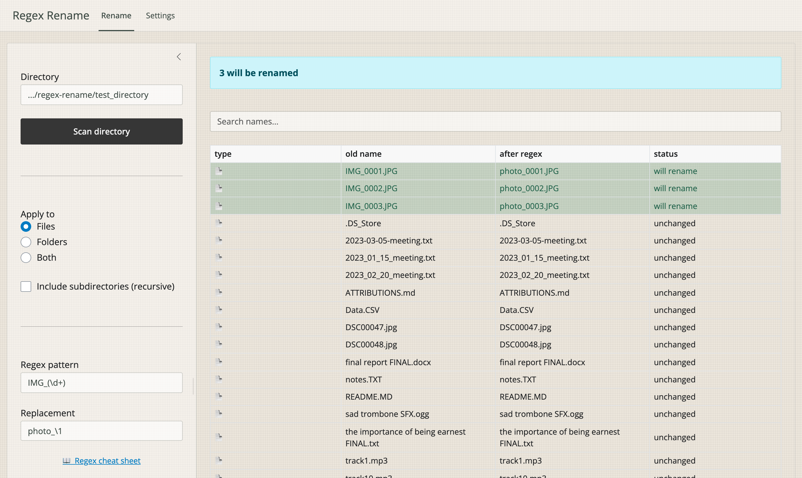

# Regex Rename

A [Shiny for Python](https://shiny.posit.co/py/) app for bulk-renaming files and
folders in a directory using regular expressions, with a live preview and safety
checks before anything is written to disk.

<p align="center">
  <picture>
    <source media="(prefers-color-scheme: dark)" srcset="assets/regex-rename-dark.png">
    
  </picture>
</p>

## Features

- Point at any directory and **scan** it for its contents.
- Apply a **regex pattern + replacement** (`re.sub` syntax, so backreferences
  like `\1` work) to filenames.
- Target **files**, **folders**, or **both**, optionally recursing into
  subdirectories.
- **Live interactive preview grid** (`current name` → `after regex` + `status`)
  that updates as you type — nothing touches disk until you confirm. Each row
  carries a 📁/📄 type icon, and rows that will change float to the top.
- **Click any column header to sort** (ascending/descending).
- **Extra columns** you can toggle on via checkboxes (multiple at once): date
  modified, date created, file size, extension, full path, depth, name length,
  and owner — so you can sort/scan by whatever attribute matters.
- **Search bar** to filter the grid by current or proposed name.
- A built-in **regex cheat sheet** (button by the pattern field) with common
  tokens and rename-focused examples.
- **Themeable skins** in a Settings tab — plain Classic Light/Dark plus
  textured skins (Linen, Natural Canvas, Cyanotype, Slate Carbon, Graphite
  Mesh, Gunmetal, Blueprint, Circuit Navy, Denim), all pure CSS.
- Colored **status** per row (green = will rename, grey = unchanged, red =
  problem) so you can see at a glance what will happen.
- Optional **case-insensitive** matching and **name-only** matching that keeps
  file extensions intact.
- Safety checks: collision detection, target-exists conflicts, invalid-name
  guards, and deepest-first ordering so renaming a parent folder can't
  invalidate its children.
- Dismissible notifications reporting successes and per-item failures.

## Requirements

- Python 3.9+
- [`shiny`](https://pypi.org/project/shiny/) and
  [`pandas`](https://pypi.org/project/pandas/) (see `requirements.txt`)

### Setup

Create an isolated virtual environment and install the pinned dependencies.

**macOS / Linux**

```bash
python3 -m venv .venv
source .venv/bin/activate
pip install -r requirements.txt
```

**Windows (PowerShell)**

```powershell
py -m venv .venv
.venv\Scripts\Activate.ps1
pip install -r requirements.txt
```

## Running

```bash
shiny run --reload app.py
```

Then open the URL it prints (default http://127.0.0.1:8000).

## Try it out

A ready-made [`test_directory/`](test_directory/) with deliberately messy
filenames is included so you can experiment safely. Point the app's
**Directory** field at its full path and follow the scenarios in
[`test_directory/README.md`](test_directory/README.md). To reset it after
renaming:

```bash
git checkout -- test_directory && git clean -fd test_directory
```

> ⚠️ This renames real files. Test on a throwaway folder first, and note that
> the **Confirm & apply** button applies the full plan, not just the rows shown
> by the search filter.

## License

Released under the [MIT License](LICENSE). The bundled sample media in
`test_directory/` is credited in
[`test_directory/ATTRIBUTIONS.md`](test_directory/ATTRIBUTIONS.md).
